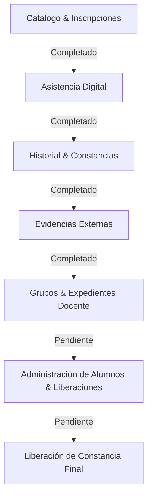

# SAAC — Roadmap de Desarrollo

Este documento resume el progreso actual del **Sistema de Administración de Actividades Complementarias (SAAC)**, detallando los módulos completados, los elementos que aún se encuentran pendientes (vistas estáticas placeholders) y recomendaciones técnicas y de seguridad clave.

---

## 🗺️ Progreso del Proyecto



---

## ✅ 1. Lo Hecho (Completado y Conectado)

### 🎓 Módulo de Inscripción (Alumno)
* **Catálogo Dinámico**: Muestra las actividades con su instructor, horarios, cupos reales e inscripciones previas.
* **Control de Restricciones**: Reglas de negocio automatizadas en base de datos (límite de 2 actividades por periodo, no duplicidad, prevención de inscripción si el cupo está lleno, validación de traslapes de horario).
* **Barra de Progreso**: Visualización en tiempo real del progreso de créditos del estudiante.

### 📝 Módulo de Asistencia Digital (Docente)
* **Pase de Lista Semanal**: Registro masivo de asistencias de lunes a viernes en una matriz dinámica.
* **Porcentaje en Tiempo Real**: Cálculo interactivo del porcentaje de asistencia del periodo.
* **Acreditación Automática**: Proceso final atómico; los alumnos con **>= 60% de asistencia** se acreditan y reciben los créditos de forma inmediata en su expediente, de lo contrario se marcan como reprobados.

### ⚙️ Gestión de Catálogo CRUD (Administrador)
* **Tablero de KPIs**: Estadísticas dinámicas de talleres activos, cupos disponibles y docentes.
* **Formularios de Modal**: Creación, actualización y eliminación lógica de actividades validando tipos y claves.

### 📜 Historial & Constancias (Alumno)
* **Historial Completo**: Registro visual del estado de sus cursos (Acreditado, Reprobado, En Curso).
* **Descarga de Constancias**: Listado interactivo de cursos aprobados con autogeneración de folios digitales.

### 📂 Acreditación de Evidencias Externas (Acreditación Externa)
* **Carga de Archivos**: Subida multipart de constancias externas (JPG, PNG, PDF, máx 5MB) por el alumno.
* **Validación Administrativa**: Panel de revisión con visualización/descarga de comprobantes y validación (Aprobación otorgando créditos específicos vs Rechazo forzando un motivo).

---

## ⏳ 2. Por Hacer (Módulos Pendientes - Vistas Estáticas)

Actualmente en `routes/web.php` existen 4 rutas secundarias que únicamente renderizan vistas fijas de React (`placeholder templates`). Estos representan el trabajo pendiente de integración:

### 👥 Módulo de Docente
1. **Vista de Grupos (`/grupos` -> `Docente/Grupos.jsx`)**:
   * **Objetivo**: Conectar con la base de datos para listar los grupos actuales y pasados asignados a ese profesor, incluyendo estadísticas del periodo.
2. **Vista de Expedientes (`/expedientes` -> `Docente/Expedientes.jsx`)**:
   * **Objetivo**: Permitir al instructor visualizar los detalles del desempeño escolar, asistencias históricas y créditos acumulados de sus alumnos inscritos.

### 👑 Módulo de Administrador
3. **Administración de Alumnos (`/admin/alumnos` -> `Admin/Alumnos.jsx`)**:
   * **Objetivo**: Catálogo administrativo para listar todos los estudiantes del instituto, filtrar por carrera o semestre, y permitir modificaciones directas sobre sus créditos acumulados.
4. **Constancias de Liberación (`/admin/constancias` -> `Admin/Constancias.jsx`)**:
   * **Objetivo**: Generar la **Constancia de Liberación de Actividad Complementaria** final una vez que el alumno acumule los 5 créditos requeridos de manera general. Debe incluir firma digital/folio oficial de la oficina de control escolar.

---

## 💡 3. Recomendaciones Técnicas y de Seguridad

Para llevar la aplicación a un nivel apto para producción (`Production Ready`), se aconsejan las siguientes mejoras:

### 🔒 Seguridad y Control de Acceso
* **Escaneo de Malware (File Uploads)**: Incorporar un analizador de malware (como ClamAV) en la subida de evidencias externas del alumno para evitar scripts maliciosos.
* **Gateway de Descargas de Archivos**: En lugar de exponer directamente la ruta `/storage/evidencias/...` de forma pública en el servidor web:
  ```php
  // Implementar un controlador intermedio con control de permisos
  Route::get('/evidencias/{solicitud}/descargar', [AdminEvidenciaController::class, 'descargar']);
  ```
  De este modo, se restringe la visualización del archivo a directivos o al propio alumno dueño del documento.

### ⚡ Optimización del Rendimiento
* **Índices en SQLite / PostgreSQL**: Añadir índices en las llaves foráneas y campos de consulta frecuente en las migraciones:
  ```php
  $table->index(['inscripcion_id', 'fecha']);
  $table->index('alumno_id');
  ```
* **Carga Ansiosa (Eager Loading)**: Prevenir consultas duplicadas (problema N+1) utilizando `with()` al listar expedientes de alumnos y asistencias en los controladores.

### 🎨 Experiencia de Usuario (UX)
* **Notificaciones Toast**: Migrar las alertas nativas estáticas a notificaciones tipo Toast flotantes y temporales que aparezcan suavemente en la esquina del navegador.
* **Modo Oscuro**: Implementar el soporte nativo de Tailwind para cambiar entre temas claros y oscuros según las preferencias del sistema del usuario.
