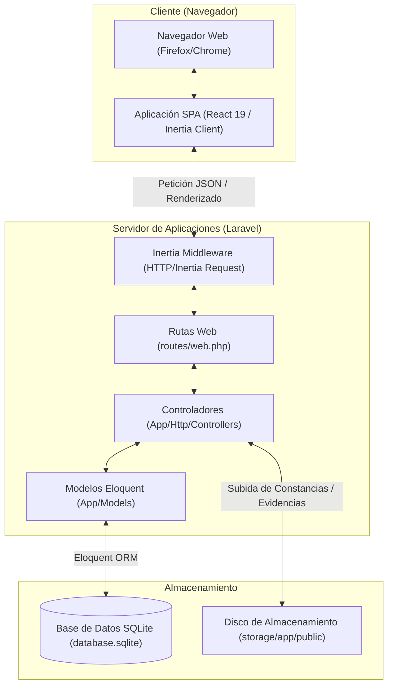
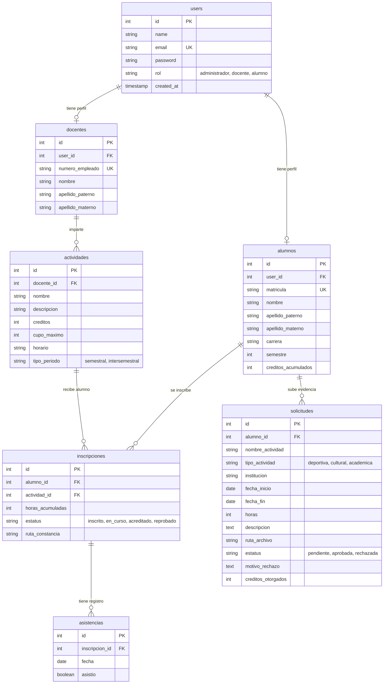

# SAAC — Manual de Arquitectura y Reglas de Negocio

Este manual describe la arquitectura interna, el modelo de datos, los controles de seguridad y las reglas lógicas duras implementadas en el **Sistema de Acreditación de Actividades Complementarias (SAAC)**.

---

## 🏗️ 1. Arquitectura del Sistema (C4 Containers)

SAAC adopta un enfoque monolítico híbrido utilizando **Inertia.js** para eliminar la necesidad de construir APIs REST separadas. El frontend de React y el backend de Laravel se comunican de forma transparente a través de peticiones HTTP estándar.

---

## 📊 2. Modelo de Datos (ERD)

La base de datos relacional almacena la información estructurada en 8 tablas clave. El motor físico es **SQLite** (usando transacciones atómicas).

---

## 🔒 3. Seguridad, Roles y Registro

### Control de Accesos
El sistema utiliza el middleware nativo de Laravel `auth` y valida la propiedad `rol` del usuario en cada endpoint crítico para prevenir la escalación de privilegios:
* **Alumno**: Solo puede inscribirse, subir evidencias y ver su historial personal.
* **Docente**: Restringido a pases de lista y visualización de grupos bajo su ID (`docente_id`).
* **Administrador**: Control total sobre el catálogo de talleres (CRUD) y revisión de solicitudes de validación de evidencias externas.

### 📧 Flujo Seguro de Pre-registro de Alumnos
Para evitar el autoregistro descontrolado y asegurar que solo los estudiantes oficiales tengan acceso, se implementó el siguiente flujo:
1. **Pre-registro**: La institución precarga las direcciones de correo institucional de los estudiantes autorizados en la base de datos de usuarios (con una contraseña temporal aleatoria o estado inactivo).
2. **Generación del Enlace**: Se le proporciona al alumno un enlace de activación único asociado a su correo institucional.
3. **Establecimiento de Contraseña**: Al acceder por primera vez a este enlace de activación, el sistema solicita al estudiante ingresar y confirmar la contraseña definitiva que desea usar en su cuenta, activándola formalmente en el sistema.

---

## ⚙️ 4. Reglas de Negocio Duras

El sistema asegura la integridad de la información académica aplicando validaciones estrictas y atómicas:

### A. Restricción de Carga Académica (Inscripciones)
* **Límite de Cursos**: Un alumno solo puede tener un máximo de **2 inscripciones activas** (`estatus` en `'inscrito'` o `'en_curso'`) por ciclo.
* **Traslape de Horarios**: Al intentar inscribirse a una actividad, el sistema valida que el horario no choque con sus inscripciones previas:
  * Ejemplo: Si cursa un taller con horario `Lun y Mié, 10:00 – 12:00 hrs`, no se le permitirá inscribirse a un taller con horario `Lun y Mié, 11:00 – 13:00 hrs`.
* **Doble Inscripción**: No está permitido cursar la misma actividad dos veces simultáneamente.

### B. Pase de Lista y Acreditación Automática (Docente)
* **Transacciones Atómicas**: El pase de lista se procesa bajo un bloque de transacción SQL (`DB::transaction`). Si un registro falla, todo el lote de la semana es revertido.
* **Pase de Lista restringido a días hábiles**: Solo se registra asistencia en los días correspondientes al taller.
* **Acreditación Final por Asistencia**: Al realizar el cierre de actas:
  $$\text{Porcentaje de Asistencia} = \left( \frac{\text{Días Asistidos}}{\text{Total de Clases Registradas}} \right) \times 100$$
  * Si el porcentaje es **>= 60%**: La inscripción pasa a `'acreditado'` y los créditos del taller se **suman automáticamente** al expediente del alumno (`creditos_acumulados`).
  * Si es **< 60%**: Pasa a `'reprobado'` y no se otorga ningún crédito.

### C. Acreditación Externa (Evidencias)
* **Restricción de Archivos**: Los comprobantes se limitan estrictamente a formatos `PDF`, `JPG`, `JPEG` o `PNG` y un tamaño máximo de **5MB**.
* **Motivo de Rechazo**: Si la evidencia es rechazada por el administrador, es obligatorio registrar la causa (por ejemplo, "Falta sello oficial") para que el estudiante pueda verla en su panel.
